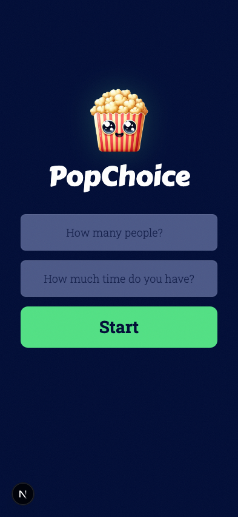
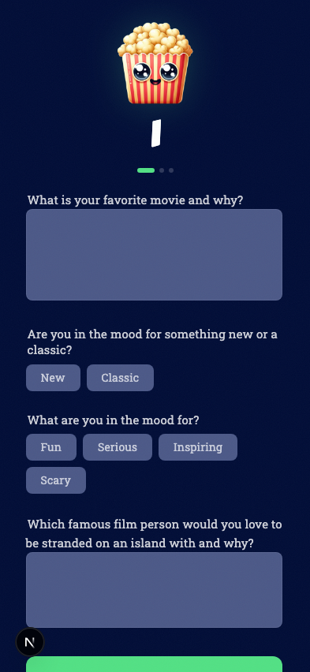
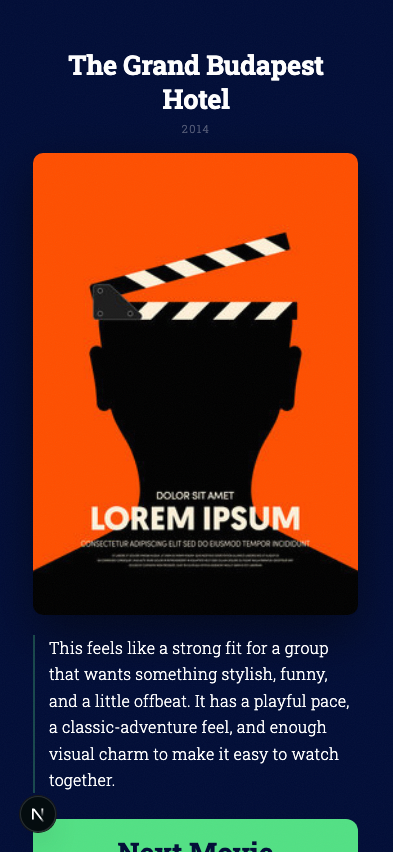
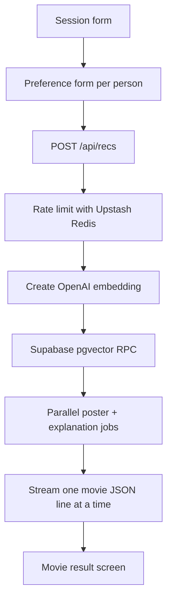

# PopChoice

PopChoice is a Next.js movie recommendation app for groups. It asks how many
people are watching, collects each person's preferences, searches a Supabase
pgvector movie database with an OpenAI embedding, and returns a small set of
movie picks with posters and AI-written explanations.

The project was built as a practical RAG/vector-search learning app: the UI is
simple, but the backend flow uses real pieces you would use in production,
including embeddings, vector similarity search, a streaming API route,
API-backed poster lookup, schema validation, and Redis-backed rate limiting.

## Preview

<table>
  <tr>
    <th>Start</th>
    <th>Preferences</th>
    <th>Recommendation</th>
  </tr>
  <tr>
    <td></td>
    <td></td>
    <td></td>
  </tr>
</table>

The recommendation preview uses the app's result layout with the fallback poster
asset so the README can show the UI without calling OpenAI, Supabase, or TMDB.

## What It Does

- Collects a viewing session: group size and available time.
- Loops through a preference form for each person in the group.
- Combines all preferences into one semantic search query.
- Creates an OpenAI embedding from the group preference summary.
- Searches Supabase pgvector rows with a `match_popmovies` RPC.
- Uses TMDB to fetch poster artwork for each matched movie.
- Uses OpenAI Responses API to explain why each movie fits the group.
- Streams recommendations back one at a time as each movie finishes processing.
- Shows one movie at a time with a `Next Movie` / `Reset` flow.
- Prevents duplicate recommendations when multiple retrieved chunks belong to
  the same movie.
- Holds the last streamed movie in a loading state until the stream finishes, so
  `Reset` only appears when the full recommendation set is complete.
- Keeps result cards hidden until the poster image has loaded.
- Uses smooth transitions between setup, preference, loading, and result screens.
- Handles no-match and rate-limit states with styled fallback screens.
- Protects the recommendation API route with Upstash Redis rate limiting.

## Built With

| Area | Tech |
|---|---|
| App framework | Next.js 16 App Router |
| UI | React 19 |
| Language | TypeScript |
| Styling | Tailwind CSS v4 plus custom CSS in `app/globals.css` |
| Validation | Zod |
| Embeddings | OpenAI `text-embedding-3-small` |
| AI response | OpenAI Responses API with `gpt-5-nano` |
| Vector database | Supabase Postgres + pgvector |
| Movie posters | TMDB Search API |
| Text chunking | LangChain `RecursiveCharacterTextSplitter` |
| Rate limiting | Upstash Redis + `@upstash/ratelimit` |
| Seed script runtime | `tsx` |

## How It Works



The main flow lives in [app/page.tsx](app/page.tsx). The page keeps track of the
current step, accumulated preferences, generated recommendations, and current
movie index. It reads the streamed response from `/api/recs` and appends each
movie as it arrives.

The recommendation route lives in [app/api/recs/route.ts](app/api/recs/route.ts).
It rate-limits the request, validates the payload with Zod, then streams results
from the core recommendation pipeline in [lib/movieRecs.ts](lib/movieRecs.ts).

## Project Structure

```text
app/
  api/recs/route.ts Streaming recommendation API route and rate-limit check
  globals.css       App styling, layout, animation, and screen system
  layout.tsx        Root layout and fonts
  page.tsx          Client-side wizard state machine

components/
  sessionForm.tsx   First form: people count and available time
  prefForm.tsx      Repeated preference form for each person
  movie.tsx         Recommendation result card/screen

lib/
  instructions.ts   System prompt for movie explanations
  movieRecs.ts      Async generator: embed, search, enrich, and yield movies
  openai.ts         OpenAI client
  ratelimit.ts      Upstash Redis rate limiter
  schemas.ts        Zod schemas and shared TypeScript types
  splitter.ts       LangChain splitter config for seed data
  supabase.ts       Supabase client
  tmdb.ts           TMDB poster search helper

scripts/
  seedMovies.ts     Reads movie text data, chunks it, embeds it, and inserts rows

data/
  movies.txt        Source movie data used by the seed script

docs/images/
  README preview screenshots
```

## Getting Started

Install dependencies:

```bash
npm install
```

Create `.env.local`:

```env
OPENAI_API_KEY=
NEXT_PUBLIC_SUPABASE_URL=
SUPABASE_API_KEY=
TMDB_TOKEN=
UPSTASH_REDIS_REST_URL=
UPSTASH_REDIS_REST_TOKEN=
```

Run the development server:

```bash
npm run dev
```

Open:

```text
http://localhost:3000
```

## Database Setup

The app expects a Supabase table named `pop_choice` with a pgvector embedding
column. The embedding size should match `text-embedding-3-small`, which is
`1536` dimensions by default.

Suggested table shape:

```sql
create extension if not exists vector;

create table pop_choice (
  id bigint generated always as identity primary key,
  title text not null,
  release_year int4 not null,
  content text not null,
  embedding vector(1536) not null
);
```

The recommendation search uses a Supabase RPC:

```sql
create or replace function match_popmovies(
  query_embedding vector(1536),
  match_threshold float,
  match_count int
)
returns table(
  id bigint,
  title text,
  release_year int4,
  content text,
  similarity float
)
language sql
as $$
  select
    pop_choice.id,
    pop_choice.title,
    pop_choice.release_year,
    pop_choice.content,
    1 - (pop_choice.embedding <=> query_embedding) as similarity
  from pop_choice
  where 1 - (pop_choice.embedding <=> query_embedding) > match_threshold
  order by pop_choice.embedding <=> query_embedding
  limit match_count;
$$;
```

## Seeding Movies

Movie source data lives in [data/movies.txt](data/movies.txt). To populate
Supabase:

```bash
npm run seed
```

The seed script:

1. Loads `.env.local` with `@next/env`.
2. Reads `data/movies.txt`.
3. Splits movie sections by blank lines.
4. Parses each movie title and release year.
5. Chunks each section with LangChain.
6. Creates an OpenAI embedding for each chunk.
7. Deletes existing rows for the same movie titles.
8. Inserts fresh rows into `pop_choice`.

This makes the seed script safer to rerun after editing the source movie data.

## Usage

1. Enter how many people are watching and how much time the group has.
2. Each person answers the same preference questions:
   - favorite movie and why
   - new or classic
   - current mood
   - favorite film person
3. The final person clicks `Get Movie`.
4. The app posts the group preferences to `/api/recs`.
5. The route streams recommendations back as each poster/explanation pair is ready.
6. Click `Next Movie` to move through matches.
7. On the last movie, click `Reset` to start again.

## Rate Limiting

The recommendation API route is rate-limited with Upstash Redis:

```ts
Ratelimit.slidingWindow(5, "6 h")
```

That means each detected IP gets 5 recommendation requests per 6-hour sliding
window. This is intentionally strict because each recommendation can call
OpenAI, Supabase, and TMDB.

The limiter reads these env vars through `Redis.fromEnv()`:

```env
UPSTASH_REDIS_REST_URL=
UPSTASH_REDIS_REST_TOKEN=
```

## Scripts

```bash
npm run dev      # Start local Next.js dev server
npm run build    # Build for production
npm run start    # Start production server after build
npm run lint     # Run ESLint
npm run seed     # Seed Supabase with embedded movie chunks
```

## Deployment Notes

Before deploying, configure these environment variables in your hosting
provider:

```env
OPENAI_API_KEY
NEXT_PUBLIC_SUPABASE_URL
SUPABASE_API_KEY
TMDB_TOKEN
UPSTASH_REDIS_REST_URL
UPSTASH_REDIS_REST_TOKEN
```

Only `NEXT_PUBLIC_SUPABASE_URL` should be public. All other values must stay
server-side.

The app is deployed on Render:

```text
https://pop-choice-fgee.onrender.com
```

It is also deployed on Vercel:

```text
https://pop-choice-kappa.vercel.app
```

The Vercel deployment uses the same Next.js route handler. The recommendation
route is configured for the Node.js runtime with a 60-second max duration because
it performs multiple external calls while streaming results.

Make sure the Supabase RPC and `pop_choice` table exist before trying either
deployed recommendation flow. The deployed route at `/api/recs` should return a
stream of newline-delimited movie JSON objects.

## What I Learned Building It

This project connects several concepts that usually appear separately:

- client-side multi-step form state
- Zod validation for browser `FormData`
- streaming route handlers as the bridge between UI and backend work
- OpenAI embeddings for semantic search
- pgvector similarity search in Supabase
- using retrieved context to generate concise natural-language explanations
- external API enrichment with TMDB posters
- Redis-backed rate limiting for deployment safety
- progressive recommendation rendering with streamed results

## Future Improvements

- Add automated tests for form flow and recommendation fallback states.
- Add a typed Supabase client generated from the database schema.
- Store richer movie metadata for filtering by runtime, genre, and rating.
- Add swipe gestures on the recommendation screen.
- Add a larger movie dataset.
- Add a dedicated admin-only seed route or CLI confirmation prompt.
