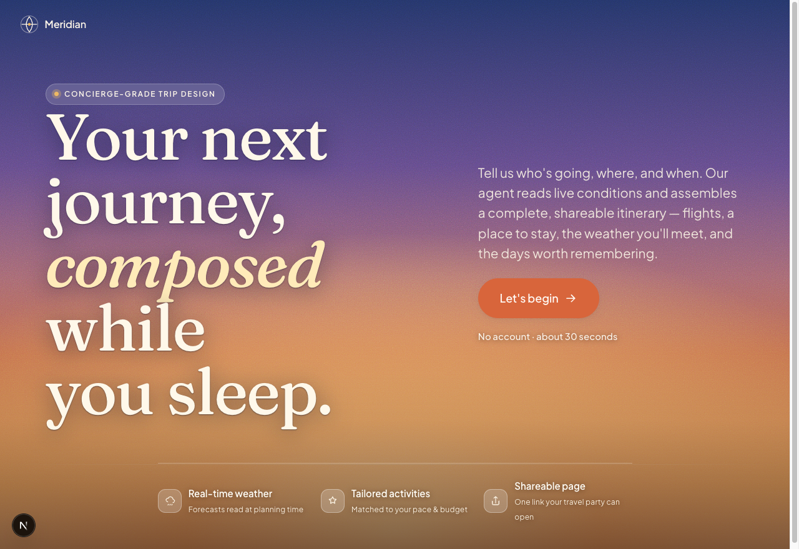
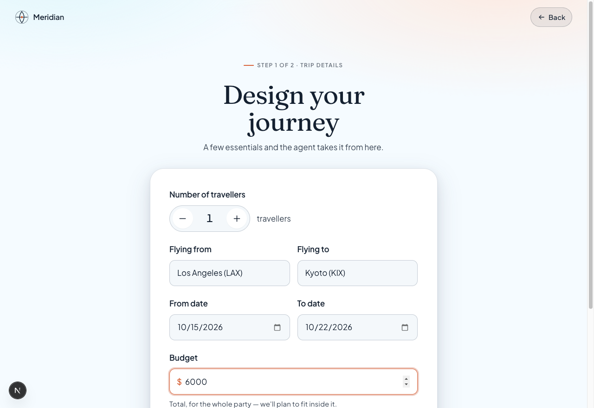
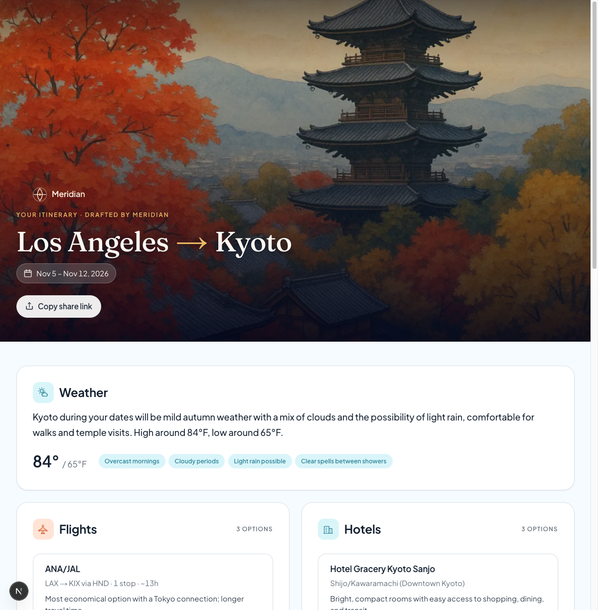

# Meridian — AI Travel Agent

Enter who's going, where, and the dates — an AI agent assembles a complete,
**shareable trip page**: flight and hotel options, **real weather** for the
destination, weather-aware activity ideas, and an AI-generated destination
photo. No login, ~30 seconds.

A solo learning project: built to practice **LLM agents + function/tool calling**,
**structured outputs**, **Server Actions**, and a production-grade **design system**.

<!-- markdownlint-disable MD033 -->

## Preview

| Landing | Trip form | Itinerary |
| --- | --- | --- |
|  |  |  |

> Screenshots live in `docs/screenshots/`. Replace the three PNGs to refresh them.

## What it does

1. **You fill a short form** — travellers, origin, destination, dates, budget.
2. **An AI agent plans the trip.** It calls a live **weather tool**, then returns a
   structured plan: **2–3 flight & hotel options** (with prices), a weather summary
   with high/low temps and conditions, and a set of activities.
3. **A destination image is generated** in parallel and stored.
4. **You land on a shareable itinerary page** at `/trips/<id>` — copy the link and
   send it to your travel party.

## How it works

```
Form ──submit──▶ addTrip (Server Action)
                   │  1. rate-limit by IP (Upstash)
                   │  2. validate input (Zod)
                   │  3. Promise.all:
                   │       • makePlanV2  ── AI SDK generateText + getWeather tool
                   │                        └▶ structured output (GeneratedPlanSchema)
                   │       • generateImage ── gpt-image-1 ──▶ Vercel Blob
                   │  4. merge {form facts + AI plan + image url}, validate again
                   │  5. store in Redis (travel:<id>, 30-day TTL)
                   └──▶ redirect /trips/<id>  ──▶ render itinerary
```

**Design decisions worth calling out:**

- **The model only generates what it generates.** Origin/dest/dates come from the
  user's form and are merged in server-side — the LLM can't overwrite your facts.
- **Real weather, fabricated travel.** Weather is a real API (OpenWeatherMap);
  flights/hotels are LLM-generated (this is a learning demo, not a booking engine).
- **Stateless + self-cleaning.** The trip is encoded by an id in Redis with a TTL;
  expired/unknown ids render a branded 404.
- **Two agent implementations.** `lib/agent-aisdk.ts` (the live one, Vercel AI SDK)
  and `lib/agent.ts` (a hand-written OpenAI Responses tool-loop, kept as a learning
  reference for *how the loop works under the hood*).

## Tech stack

| Area | Choice |
| --- | --- |
| Framework | **Next.js 16** (App Router, Turbopack), **React 19**, TypeScript (strict) |
| Styling | **Tailwind CSS v4** (no config file; tokens via `@theme`) — "Dusk Horizon" system |
| Design tooling | **Open Design** `frontend-design` skill → ported prototype |
| Validation | **Zod v4** (source of truth via `z.infer`) |
| AI — plan | **Vercel AI SDK** (`generateText` + `Output.object`), OpenAI `gpt-5-nano` |
| AI — image | OpenAI **`gpt-image-1`** |
| Weather | **OpenWeatherMap** (geocoding + 5-day forecast) |
| Storage | **Upstash Redis** (trip data) · **Vercel Blob** (image) |
| Safety | IP rate limiting (Upstash) · prompt-injection hardening · Zod bounds |
| UX | Server Actions + `useActionState` (inline error states) |

## Getting started

```bash
npm install
cp .env.example .env.local   # then fill in the values below
npm run dev                  # http://localhost:3000
```

All keys are **server-only**:

| Variable | Used for |
| --- | --- |
| `OPENAI_API_KEY` | trip plan (AI SDK) + destination image |
| `WEATHER_API_KEY` | OpenWeatherMap geocoding + forecast |
| `BLOB_READ_WRITE_TOKEN` | Vercel Blob (stores the image) |
| `UPSTASH_REDIS_REST_URL` / `UPSTASH_REDIS_REST_TOKEN` | Redis (trip store + rate limit) |

```bash
npm run build   # production build
npm run lint
```

## Project structure

```
app/
  page.tsx               # landing hero + trip form (client toggle)
  layout.tsx             # fonts (Fraunces + Inter), theme
  globals.css            # "Dusk Horizon" tokens + component styles
  trips/[id]/page.tsx    # itinerary result (server component)
  trips/[id]/not-found.tsx
components/
  tripForm.tsx           # the form (Server Action + useActionState)
  shareButton.tsx        # copy-link button
lib/
  actions.ts             # addTrip Server Action (orchestration)
  agent-aisdk.ts         # makePlanV2 — live AI SDK agent
  agent.ts               # makePlanV1 — manual OpenAI tool-loop (reference)
  tools.ts               # getWeather + generateImage
  schemas.ts             # Zod schemas (source of truth)
  prompts.ts             # system prompt + injection-hardened user prompt
  redis.ts / ratelimit.ts / openai.ts
```

## Notes & limitations

- OpenWeatherMap's free forecast is ~5 days out, so far-future trips get a general
  weather summary rather than an exact forecast.
- Flights/hotels are fabricated by the LLM — there's no real inventory or booking.
- Each submit calls an LLM + image model; the per-IP rate limit (5/hour) keeps cost
  and abuse in check.

---

Built by [Aziz](https://github.com/azizu06) as a learning project.
